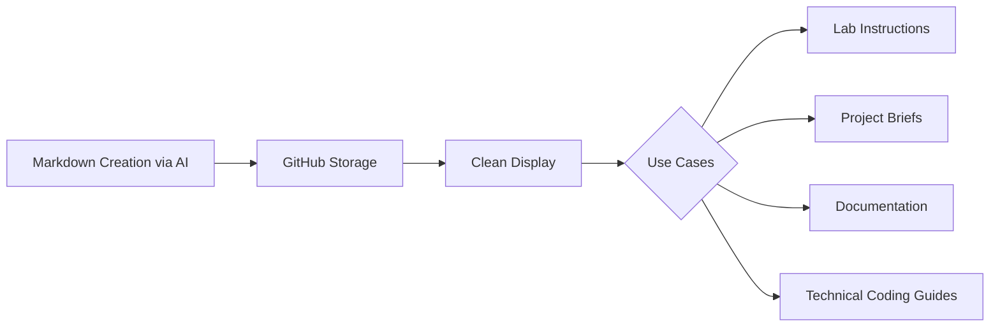
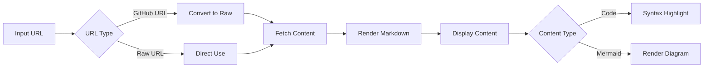
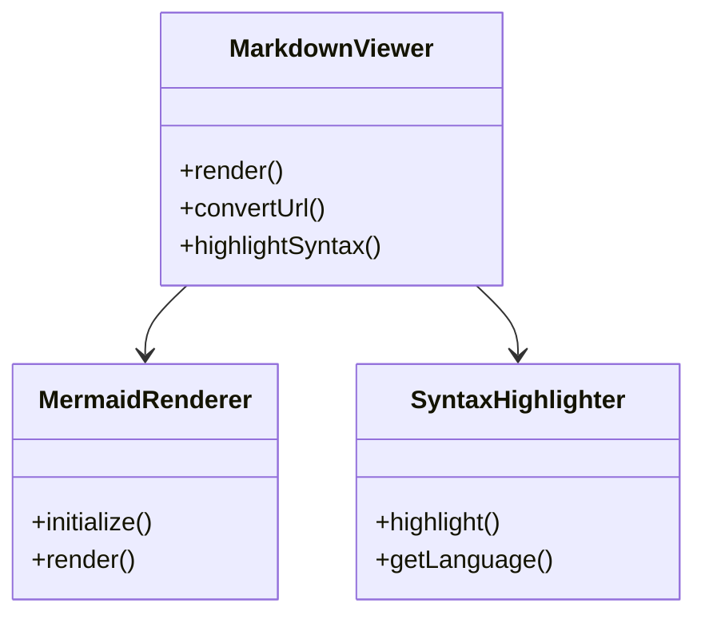
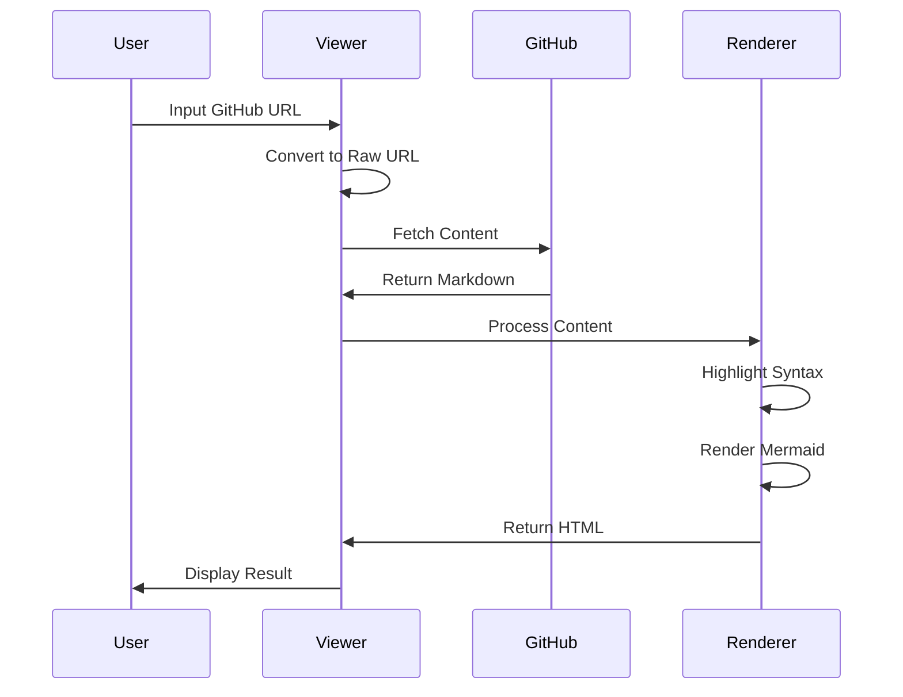
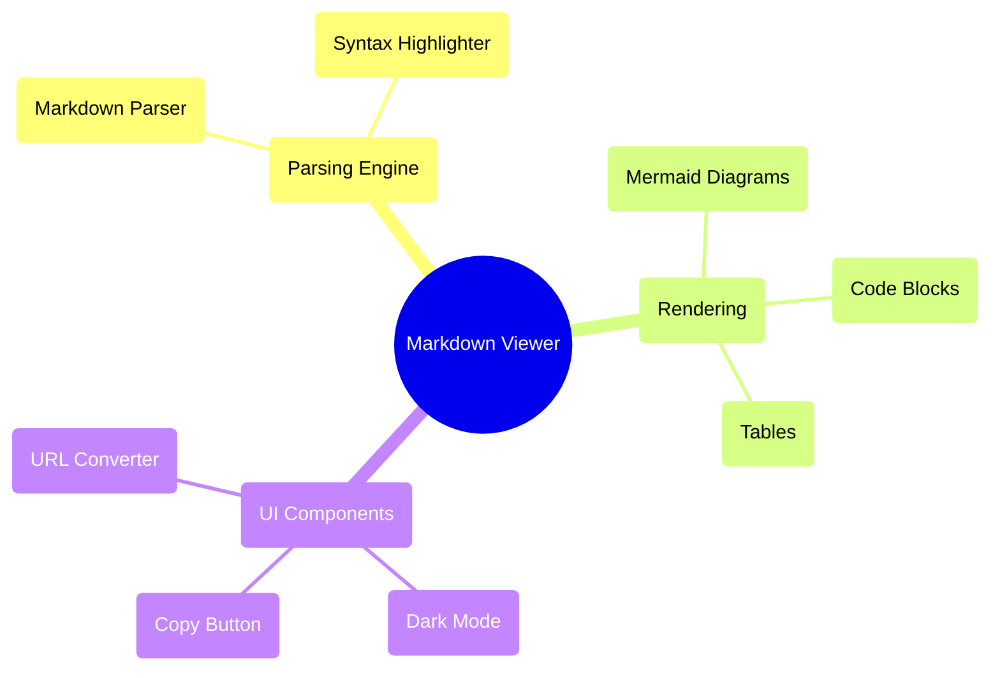
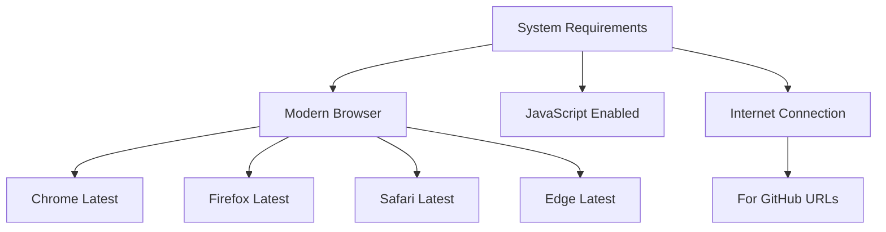

# GitHub Markdown Browser Viewer

# Overview

The GitHub Markdown Viewer is a specialized tool that renders GitHub markdown files in a clean, standalone interface. It faithfully reproduces GitHub's native markdown rendering capabilities while eliminating surrounding repository elements, providing a distraction-free reading experience.

## Purpose

This viewer addresses several key needs:
- Renders markdown files with GitHub-faithful styling
- Provides a standalone, clutter-free display
- Supports complex elements including:
  - Syntax-highlighted code blocks
  - Interactive Mermaid diagrams
  - Tables and formatting

## Key Benefits

- **Educational Use**: Ideal for displaying laboratory instructions, project briefs, and technical documentation
- **Professional Presentation**: Offers clean, consistent formatting without platform-specific distractions
- **Modern Alternative**: Replaces traditional word processors where code formatting is challenging
- **AI Integration**: Seamlessly handles AI-generated markdown content, making it perfect for documentation workflows that leverage AI tools



## Features

- 🎨 GitHub-style markdown rendering
- 📊 Native Mermaid diagram support
- 💻 Syntax highlighting for code blocks
- 📋 GitHub-style copy button for code blocks
- 🌓 Automatic dark mode support
- 🔄 Direct GitHub URL conversion
> **🌐 Live at: https://danielcregg.github.io/markdown-browser-viewer/**

## Quick Usage

There are two ways to use this viewer:

1. **Direct URL**: Visit the website above and enter your markdown URL in the textbox provided.
   ```
   https://danielcregg.github.io/markdown-browser-viewer/
   ```

2. **URL Parameter**: Append your markdown URL to the website's URL like below:
   
   https:\/\/danielcregg.github.io/markdown-browser-viewer/**?url=https://github.com/danielcregg/example-coding-lab/blob/main/my-coding-lab.md**
   

For example, to view "Week 7 Lab: AI Recipe Generator", simply append its URL to the viewer's URL.

---


## How It Works



## Architecture



## Processing Flow



## Components & Dependencies



## System Requirements



## Dark Mode Behavior

```mermaid
stateDiagram-v2
    [*] --> CheckPreference
    CheckPreference --> LightMode: System Light
    CheckPreference --> DarkMode: System Dark
    
    LightMode --> UpdateUI: Apply Light Theme
    DarkMode --> UpdateUI: Apply Dark Theme
