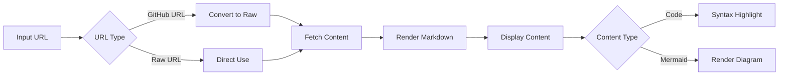
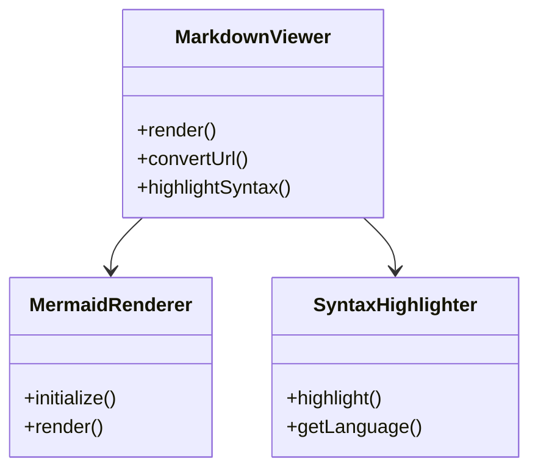
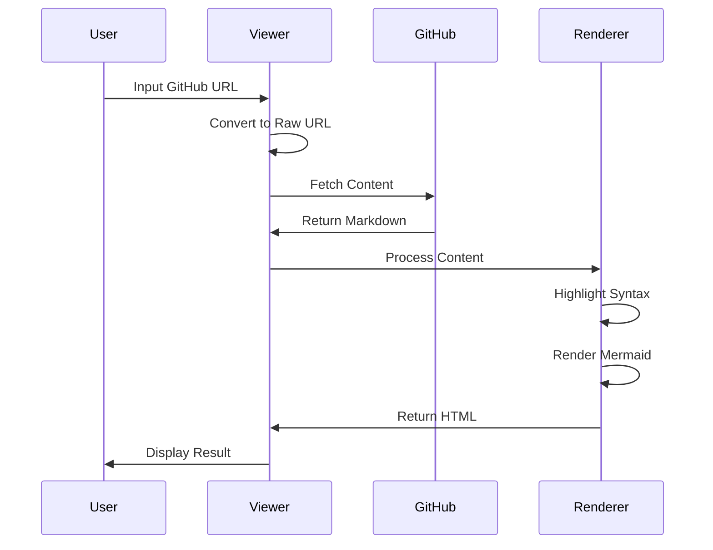

# GitHub Markdown Viewer

A lightweight, browser-based markdown viewer that closely mimics GitHub's markdown rendering, complete with syntax highlighting, mermaid diagrams support, and a GitHub-like interface.

## Features

- 🎨 GitHub-style markdown rendering
- 📊 Native Mermaid diagram support
- 💻 Syntax highlighting for code blocks
- 📋 GitHub-style copy button for code blocks
- 🌓 Automatic dark mode support
- 🔄 Direct GitHub URL conversion
- 🎯 Faithful recreation of GitHub's styling

## Quick Start

```html
<!DOCTYPE html>
<html>
<head>
    <title>GitHub Markdown Viewer</title>
</head>
<body>
    <!-- Copy the full HTML from the repository -->
</body>
</html>
```

## Usage Flow



## Code Block Example

The viewer automatically detects language and applies syntax highlighting:

```python
def example_function():
    """
    This is an example function to demonstrate syntax highlighting
    """
    data = {
        "hello": "world",
        "numbers": [1, 2, 3, 4, 5]
    }
    return data

# Output will be syntax highlighted
result = example_function()
print(result)
```

## Mermaid Diagram Support

Simply write your mermaid diagrams in code blocks with the 'mermaid' language specified:

````markdown

````

Which renders as:


## URL Handling

The viewer accepts two types of URLs:

1. Direct GitHub URLs:
   ```
   https://github.com/username/repo/blob/main/README.md
   ```

2. Raw GitHub URLs:
   ```
   https://raw.githubusercontent.com/username/repo/main/README.md
   ```

The viewer automatically converts GitHub URLs to their raw format.

## Technical Details



## Dependencies

- **marked** (v9.1.6) - Markdown parsing
- **highlight.js** (v11.7.0) - Syntax highlighting
- **mermaid** (v10.6.1) - Diagram rendering

## Browser Support

- Chrome (latest)
- Firefox (latest)
- Safari (latest)
- Edge (latest)

## Dark Mode Support

The viewer automatically detects system dark mode preferences and adjusts the theme accordingly. This includes:

- Syntax highlighting
- Mermaid diagrams
- UI elements
- Code blocks

## Installation

1. Clone this repository
2. Open the HTML file in a web browser
3. Start viewing markdown files!

## License

MIT License - feel free to use and modify as needed.
